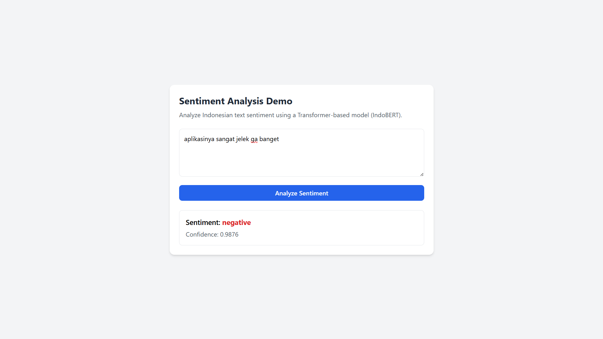
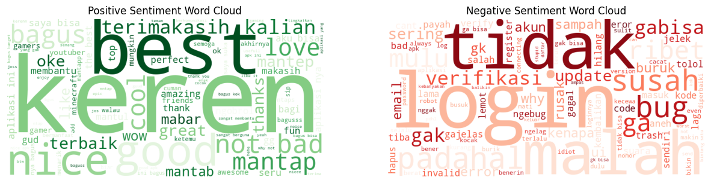

# Sentiment Analysis System for Indonesian Discord App Reviews

## Project Overview
This project implements an end-to-end **sentiment analysis system** for Indonesian-language user reviews of the Discord mobile application. The system covers the full lifecycle from data analysis and model experimentation to a **production-ready inference API**, following a lightweight and practical MLOps approach.

The project emphasizes **engineering-driven decision making**, including baseline comparison, error analysis, and deployment trade-offs, rather than solely focusing on model accuracy improvements.



---

## Dataset Description
The dataset consists of **75,141 user reviews** collected from the Google Play Store over a **10-year period**, making it the longest-running dataset in this collection.

### Key Characteristics
- **Total Reviews:** 75,141  
- **Time Period:** November 2015 – December 2025  
- **Coverage:** Captures the evolution of Discord from a niche gaming tool to a mainstream communication platform in Indonesia  
- **Unique Value:** Longitudinal dataset reflecting changes in user expectations, features, and technical issues over time  

### Rating Distribution
- **5 Stars:** ~53.4%  
- **1 Star:** ~26.9%  
- **Others (2–4 Stars):** Remaining portion  

### Observations
- High volume of **technical feedback**, particularly related to:
  - Voice connection stability
  - Login and verification issues
- Frequent discussion of **community and moderation topics**
- Strong class imbalance, reflecting real-world review behavior

---

## Problem Definition
Given a user review text, the task is to classify its sentiment into one of two categories:
- **Negative**
- **Positive**

The system uses **rating-based weak supervision**, where star ratings serve as proxy labels for sentiment.

---

## Labeling Strategy
A conservative binary labeling scheme is applied to reduce ambiguity:

| Rating | Sentiment Label |
|------|----------------|
| 1–2  | Negative (0) |
| 5    | Positive (1) |
| 3–4  | Excluded |

### Rationale
- Ratings 3 and 4 frequently contain mixed or unclear sentiment
- Excluding them improves label reliability
- This strategy is commonly used in early-stage industry experiments

---

## Exploratory Data Analysis

### Text Length vs Rating
Average review length shows a consistent pattern:

| Rating | Avg. Length (Characters) |
|------|---------------------------|
| 1 | ~76 |
| 2 | ~93 |
| 3 | ~78 |
| 4 | ~59 |
| 5 | ~32 |

**Insight:**  
Lower ratings tend to include longer, more detailed complaints, while high ratings are typically short and expressive.



---

## Modeling Approach

### Baseline Model
- **TF-IDF Vectorization**
  - n-grams: (1, 2)
  - min_df = 5
  - max_df = 0.9
- **Logistic Regression**
  - class-weighted to handle imbalance

The baseline model serves as a strong, interpretable reference commonly used in production systems.

### Transformer-Based Model
- **Model:** IndoBERT (`indolem/indobert-base-uncased`)
- Fine-tuned for binary sentiment classification
- Selected for its ability to capture contextual and linguistic nuances in Indonesian text

---

## Evaluation Results

### Baseline (TF-IDF + Logistic Regression)
- **Accuracy:** 91.16%
- **Weighted F1-score:** 0.9120
- **False Positives:** 442
- **False Negatives:** 696

### Transformer (IndoBERT)
- **Accuracy:** 91.25%
- **Weighted F1-score:** 0.9126
- **False Positives:** 427
- **False Negatives:** 550  
  (**~21% reduction compared to baseline**)

---

## Error Analysis Findings
- Errors are more common in **longer and context-rich reviews**
- Frequent error sources:
  - Mixed sentiment (e.g., “good but…”)
  - Negation and contrast
  - Informal spelling and slang
  - Rating–text inconsistencies (label noise)
- The Transformer model shows clear improvements in handling contextual and mixed-sentiment cases, even when overall accuracy gains are modest

---

## System Architecture

### Inference Pipeline
- Text cleaning (minimal and consistent with training)
- Tokenization using IndoBERT tokenizer
- Model inference with confidence scoring
- Single model load (no reload per request)

### API Layer
- Built using **FastAPI**
- Endpoints:
  - `GET /health` — service health check
  - `POST /predict` — sentiment prediction
- Input validation with Pydantic
- Output: predicted label and confidence score

---

## Logging
A lightweight logging mechanism is implemented to:
- Record incoming requests (sanitized)
- Log prediction results and confidence scores
- Support debugging and post-deployment analysis

Logs are written to both console and file.

---

## Containerization
The entire system is containerized using **Docker** to ensure:
- Environment consistency
- Reproducible deployment
- Easy local or server-based execution

The Docker image exposes the API on port **8000** and runs the FastAPI application using Uvicorn.

---

## Project Structure
```
sentiment-analysis-discord/
├── models/ # Trained model and tokenizer artifacts
├── src/
│ ├── api/ # FastAPI application
│ ├── inference/ # Model loading and prediction logic
│ ├── preprocessing/ # Text cleaning utilities
│ ├── config/ # Centralized configuration
│ └── utils/ # Logging utilities
├── tests/ # Inference tests
├── notebooks/ # Experimental notebooks (optional)
├── Dockerfile
├── requirements.txt
└── README.md
```
## Conclusion
This project demonstrates that strong classical baselines remain highly competitive on large, real-world review datasets. While the Transformer-based model provides only marginal gains in aggregate metrics, it delivers **meaningful qualitative improvements** in contextual understanding and error distribution.

The final system balances performance, interpretability, and operational simplicity, resulting in a **production-ready sentiment analysis API** suitable for real-world deployment scenarios.

## Status
The core system is complete, including:
- Data analysis and modeling
- Model comparison and error analysis
- Inference pipeline
- API layer
- Logging
- Containerization
